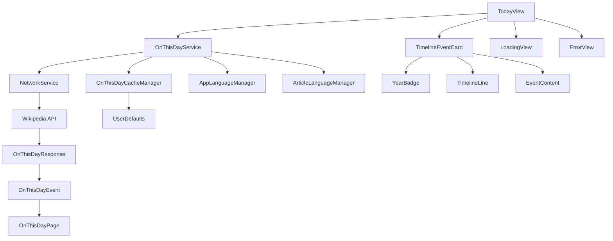

# Today Section - "On This Day" Implementation Plan

## Overview
Implement a "Today" section that displays Wikipedia's "On this day" historical events in a vertical timeline UI, similar to Wikipedia's "On this day" feature, with full offline support through caching.

## Wikipedia API Research

### API Endpoint
```
https://{language}.wikipedia.org/api/rest_v1/feed/onthisday/{type}/{month}/{day}
```

### Parameters
- `language`: Language code (e.g., `en`, `tr`, `de`, `fr`)
- `type`: Event type - `all`, `births`, `deaths`, `events`, `holidays`, `selected`
- `month`: Month number (01-12)
- `day`: Day number (01-31)

### Example URLs
- All events for January 3rd: `https://en.wikipedia.org/api/rest_v1/feed/onthisday/all/01/03`
- Events only: `https://en.wikipedia.org/api/rest_v1/feed/onthisday/events/01/03`
- Births only: `https://en.wikipedia.org/api/rest_v1/feed/onthisday/births/01/03`

### API Response Structure
```json
{
  "events": [
    {
      "year": 2020,
      "text": "Event description",
      "pages": [
        {
          "title": "Article Title",
          "thumbnail": {
            "source": "image_url",
            "width": 200,
            "height": 200
          },
          "content_urls": {
            "desktop": {
              "page": "article_url"
            }
          }
        }
      ]
    }
  ],
  "births": [...],
  "deaths": [...],
  "holidays": [...]
}
```

## Implementation Plan

### 1. Data Models

Create new models in `WikiFlick/Models/OnThisDay.swift`:

```swift
// Main response model
struct OnThisDayResponse: Codable {
    let events: [OnThisDayEvent]
    let births: [OnThisDayEvent]
    let deaths: [OnThisDayEvent]
    let holidays: [OnThisDayEvent]
}

// Event model
struct OnThisDayEvent: Identifiable, Codable {
    let id = UUID()
    let year: Int
    let text: String
    let pages: [OnThisDayPage]
}

// Page model (article reference)
struct OnThisDayPage: Codable {
    let title: String
    let thumbnail: Thumbnail?
    let contentURLs: ContentURLs
    
    enum CodingKeys: String, CodingKey {
        case title, thumbnail
        case contentURLs = "content_urls"
    }
}
```

### 2. API Service Extension

Extend `NetworkService` to add "On this day" API support:

```swift
// Add to NetworkServiceProtocol
func fetchOnThisDayEvents(month: Int, day: Int, languageCode: String) -> AnyPublisher<OnThisDayResponse, NetworkError>

// Add to NetworkService
func fetchOnThisDayEvents(month: Int, day: Int, languageCode: String) -> AnyPublisher<OnThisDayResponse, NetworkError>
```

### 3. Service Layer

Create `OnThisDayService` in `WikiFlick/Services/OnThisDayService.swift`:

```swift
class OnThisDayService: ObservableObject {
    @Published var events: [OnThisDayEvent] = []
    @Published var isLoading = false
    @Published var errorMessage: String?
    @Published var isOffline = false
    
    private let networkService: NetworkServiceProtocol
    private let cacheManager: OnThisDayCacheManagerProtocol
    
    init(
        networkService: NetworkServiceProtocol = NetworkService(),
        cacheManager: OnThisDayCacheManagerProtocol = OnThisDayCacheManager.shared
    ) {
        self.networkService = networkService
        self.cacheManager = cacheManager
    }
    
    func fetchTodayEvents(languageCode: String)
    func fetchEventsForDate(month: Int, day: Int, languageCode: String)
    func clearCache()
}
```

### 4. Caching Layer

Create `OnThisDayCacheManager` in `WikiFlick/Services/OnThisDayCacheManager.swift`:

```swift
protocol OnThisDayCacheManagerProtocol {
    func cacheEvents(_ events: [OnThisDayEvent], for date: Date, languageCode: String)
    func getCachedEvents(for date: Date, languageCode: String) -> [OnThisDayEvent]?
    func isCacheValid(for date: Date, languageCode: String) -> Bool
    func clearCache()
    func clearExpiredCache()
}

class OnThisDayCacheManager: OnThisDayCacheManagerProtocol {
    static let shared = OnThisDayCacheManager()
    
    private let cacheExpiration: TimeInterval = 24 * 60 * 60 // 24 hours
    private let userDefaults = UserDefaults.standard
    private let cacheKeyPrefix = "on_this_day_cache_"
    
    private init() {}
    
    func cacheEvents(_ events: [OnThisDayEvent], for date: Date, languageCode: String) {
        let key = cacheKey(for: date, languageCode: languageCode)
        let cacheData = OnThisDayCacheData(
            events: events,
            timestamp: Date(),
            languageCode: languageCode
        )
        
        if let encoded = try? JSONEncoder().encode(cacheData) {
            userDefaults.set(encoded, forKey: key)
            LoggingService.shared.logInfo("Cached \(events.count) events for \(date)", category: .cache)
        }
    }
    
    func getCachedEvents(for date: Date, languageCode: String) -> [OnThisDayEvent]? {
        let key = cacheKey(for: date, languageCode: languageCode)
        
        guard let data = userDefaults.data(forKey: key),
              let cacheData = try? JSONDecoder().decode(OnThisDayCacheData.self, from: data) else {
            return nil
        }
        
        return cacheData.events
    }
    
    func isCacheValid(for date: Date, languageCode: String) -> Bool {
        let key = cacheKey(for: date, languageCode: languageCode)
        
        guard let data = userDefaults.data(forKey: key),
              let cacheData = try? JSONDecoder().decode(OnThisDayCacheData.self, from: data) else {
            return false
        }
        
        let timeSinceCache = Date().timeIntervalSince(cacheData.timestamp)
        return timeSinceCache < cacheExpiration
    }
    
    func clearCache() {
        let keys = userDefaults.dictionaryRepresentation().keys.filter { $0.hasPrefix(cacheKeyPrefix) }
        for key in keys {
            userDefaults.removeObject(forKey: key)
        }
        LoggingService.shared.logInfo("Cleared all On This Day cache", category: .cache)
    }
    
    func clearExpiredCache() {
        let keys = userDefaults.dictionaryRepresentation().keys.filter { $0.hasPrefix(cacheKeyPrefix) }
        
        for key in keys {
            guard let data = userDefaults.data(forKey: key),
                  let cacheData = try? JSONDecoder().decode(OnThisDayCacheData.self, from: data) else {
                userDefaults.removeObject(forKey: key)
                continue
            }
            
            let timeSinceCache = Date().timeIntervalSince(cacheData.timestamp)
            if timeSinceCache >= cacheExpiration {
                userDefaults.removeObject(forKey: key)
            }
        }
    }
    
    private func cacheKey(for date: Date, languageCode: String) -> String {
        let formatter = DateFormatter()
        formatter.dateFormat = "yyyy-MM-dd"
        let dateString = formatter.string(from: date)
        return "\(cacheKeyPrefix)\(languageCode)_\(dateString)"
    }
}

struct OnThisDayCacheData: Codable {
    let events: [OnThisDayEvent]
    let timestamp: Date
    let languageCode: String
}
```

### 5. UI Components

#### 5.1 Timeline Event Card
Create `TimelineEventCard` component in `WikiFlick/Views/TodayView.swift`:

```swift
struct TimelineEventCard: View {
    let event: OnThisDayEvent
    let languageCode: String
    
    var body: some View {
        HStack(alignment: .top, spacing: 12) {
            // Year badge
            YearBadge(year: event.year)
            
            // Timeline line
            TimelineLine()
            
            // Event content
            EventContent(event: event, languageCode: languageCode)
        }
        .padding(.vertical, 8)
    }
}
```

#### 5.2 Year Badge
```swift
struct YearBadge: View {
    let year: Int
    
    var body: some View {
        Text(String(year))
            .font(.system(.caption, design: .rounded))
            .fontWeight(.bold)
            .foregroundColor(.white)
            .padding(.horizontal, 8)
            .padding(.vertical, 4)
            .background(
                RoundedRectangle(cornerRadius: 8)
                    .fill(Color.accentColor)
            )
            .frame(width: 60)
    }
}
```

#### 5.3 Timeline Line
```swift
struct TimelineLine: View {
    var body: some View {
        VStack(spacing: 0) {
            Circle()
                .fill(Color.accentColor)
                .frame(width: 8, height: 8)
            
            Rectangle()
                .fill(Color.gray.opacity(0.3))
                .frame(width: 2)
                .frame(maxHeight: .infinity)
        }
        .padding(.top, 4)
    }
}
```

#### 5.4 Event Content
```swift
struct EventContent: View {
    let event: OnThisDayEvent
    let languageCode: String
    @StateObject private var imageLoadingService = ImageLoadingService.shared
    
    var body: some View {
        HStack(alignment: .top, spacing: 12) {
            VStack(alignment: .leading, spacing: 8) {
                Text(event.text)
                    .font(.body)
                    .foregroundColor(.primary)
                
                if let page = event.pages.first {
                    ArticleLink(page: page, languageCode: languageCode)
                }
            }
            
            // Thumbnail
            if let page = event.pages.first,
               let thumbnailURL = page.thumbnail?.source {
                EventThumbnail(imageURL: thumbnailURL)
            }
        }
        .padding(.leading, 8)
    }
}
```

#### 5.5 Event Thumbnail
```swift
struct EventThumbnail: View {
    let imageURL: String
    @State private var image: UIImage?
    @State private var isLoading = true
    
    var body: some View {
        Group {
            if let image = image {
                Image(uiImage: image)
                    .resizable()
                    .aspectRatio(contentMode: .fill)
                    .frame(width: 80, height: 80)
                    .clipShape(RoundedRectangle(cornerRadius: 8))
                    .shadow(radius: 2)
            } else if isLoading {
                Rectangle()
                    .fill(Color.gray.opacity(0.3))
                    .frame(width: 80, height: 80)
                    .clipShape(RoundedRectangle(cornerRadius: 8))
                    .overlay(
                        ProgressView()
                            .scaleEffect(0.5)
                    )
            } else {
                Rectangle()
                    .fill(Color.gray.opacity(0.2))
                    .frame(width: 80, height: 80)
                    .clipShape(RoundedRectangle(cornerRadius: 8))
                    .overlay(
                        Image(systemName: "photo")
                            .foregroundColor(.gray)
                    )
            }
        }
        .onAppear {
            loadImage()
        }
    }
    
    private func loadImage() {
        Task {
            if let loadedImage = await ImageLoadingService.shared.loadImage(from: imageURL) {
                await MainActor.run {
                    self.image = loadedImage
                    self.isLoading = false
                }
            } else {
                await MainActor.run {
                    self.isLoading = false
                }
            }
        }
    }
}
```

#### 5.6 Article Link
```swift
struct ArticleLink: View {
    let page: OnThisDayPage
    let languageCode: String
    
    var body: some View {
        Link(destination: URL(string: page.contentURLs.desktop.page) ?? URL(string: "https://\(languageCode).wikipedia.org")!) {
            HStack(spacing: 4) {
                Text(page.title)
                    .font(.subheadline)
                    .foregroundColor(.accentColor)
                
                Image(systemName: "arrow.up.right.square")
                    .font(.caption)
                    .foregroundColor(.accentColor)
            }
        }
    }
}
```

### 6. TodayView Implementation

Update `WikiFlick/Views/TodayView.swift`:

```swift
struct TodayView: View {
    @StateObject private var onThisDayService = OnThisDayService()
    @StateObject private var languageManager = AppLanguageManager.shared
    @StateObject private var articleLanguageManager = ArticleLanguageManager.shared
    
    var body: some View {
        NavigationView {
            ZStack {
                if onThisDayService.isLoading {
                    LoadingView()
                } else if let errorMessage = onThisDayService.errorMessage {
                    ErrorView(
                        message: errorMessage,
                        isOffline: onThisDayService.isOffline,
                        retryAction: {
                            onThisDayService.fetchTodayEvents(
                                languageCode: articleLanguageManager.languageCode
                            )
                        }
                    )
                } else if onThisDayService.events.isEmpty {
                    EmptyView()
                } else {
                    ScrollView {
                        VStack(spacing: 0) {
                            // Header
                            TodayHeaderView(isOffline: onThisDayService.isOffline)
                            
                            // Timeline
                            LazyVStack(spacing: 0) {
                                ForEach(onThisDayService.events) { event in
                                    TimelineEventCard(
                                        event: event,
                                        languageCode: articleLanguageManager.languageCode
                                    )
                                }
                            }
                            .padding(.horizontal)
                        }
                    }
                }
            }
            .navigationTitle(languageManager.localizedString(key: "today"))
            .onAppear {
                onThisDayService.fetchTodayEvents(
                    languageCode: articleLanguageManager.languageCode
                )
            }
            .refreshable {
                onThisDayService.fetchTodayEvents(
                    languageCode: articleLanguageManager.languageCode
                )
            }
        }
    }
}
```

### 7. Loading and Error States

#### Loading View
```swift
struct LoadingView: View {
    var body: some View {
        VStack(spacing: 16) {
            ProgressView()
                .scaleEffect(1.5)
            Text("Loading events...")
                .font(.subheadline)
                .foregroundColor(.secondary)
        }
    }
}
```

#### Error View
```swift
struct ErrorView: View {
    let message: String
    let isOffline: Bool
    let retryAction: () -> Void
    
    var body: some View {
        VStack(spacing: 16) {
            Image(systemName: isOffline ? "wifi.slash" : "exclamationmark.triangle")
                .font(.system(size: 48))
                .foregroundColor(isOffline ? .red : .orange)
            
            Text(message)
                .font(.body)
                .multilineTextAlignment(.center)
                .padding(.horizontal)
            
            if isOffline {
                Text("Showing cached data")
                    .font(.caption)
                    .foregroundColor(.secondary)
            }
            
            Button(action: retryAction) {
                Text("Retry")
                    .font(.headline)
                    .foregroundColor(.white)
                    .padding(.horizontal, 24)
                    .padding(.vertical, 12)
                    .background(Color.accentColor)
                    .cornerRadius(8)
            }
        }
    }
}
```

### 8. Localization

Add localization keys to `WikiFlick/en.lproj/Localizable.strings`:

```
"today" = "Today";
"on_this_day" = "On This Day";
"loading_events" = "Loading events...";
"no_events_today" = "No events found for today";
"error_loading_events" = "Failed to load events";
"retry" = "Retry";
"read_more" = "Read more";
"years_ago" = "years ago";
"year_ago" = "year ago";
"showing_cached_data" = "Showing cached data";
"offline_mode" = "Offline mode";
```

Add to Turkish localization (`WikiFlick/tr.lproj/Localizable.strings`):

```
"today" = "Bugün";
"on_this_day" = "Bugün Tarihinde";
"loading_events" = "Olaylar yükleniyor...";
"no_events_today" = "Bugün için olay bulunamadı";
"error_loading_events" = "Olaylar yüklenemedi";
"retry" = "Tekrar dene";
"read_more" = "Devamını oku";
"years_ago" = "yıl önce";
"year_ago" = "yıl önce";
"showing_cached_data" = "Önbelleklenmiş veriler gösteriliyor";
"offline_mode" = "Çevrimdışı mod";
```

### 9. Date Handling

Add date utilities to get current month and day:

```swift
extension Date {
    var month: Int {
        Calendar.current.component(.month, from: self)
    }
    
    var day: Int {
        Calendar.current.component(.day, from: self)
    }
    
    var formattedDate: String {
        let formatter = DateFormatter()
        formatter.dateFormat = "MMMM d"
        formatter.locale = Locale.current
        return formatter.string(from: self)
    }
}
```

### 10. Header Component

```swift
struct TodayHeaderView: View {
    @StateObject private var languageManager = AppLanguageManager.shared
    let isOffline: Bool
    
    var body: some View {
        VStack(alignment: .leading, spacing: 8) {
            HStack {
                Text(languageManager.localizedString(key: "on_this_day"))
                    .font(.title2)
                    .fontWeight(.bold)
                
                Spacer()
                
                if isOffline {
                    HStack(spacing: 4) {
                        Image(systemName: "wifi.slash")
                            .font(.caption)
                        Text(languageManager.localizedString(key: "offline_mode"))
                            .font(.caption)
                    }
                    .foregroundColor(.orange)
                }
            }
            
            Text(Date().formattedDate)
                .font(.subheadline)
                .foregroundColor(.secondary)
        }
        .frame(maxWidth: .infinity, alignment: .leading)
        .padding()
        .background(Color.gray.opacity(0.1))
    }
}
```

## Architecture Diagram



## File Structure

```
WikiFlick/
├── Models/
│   └── OnThisDay.swift (NEW)
├── Services/
│   ├── NetworkService.swift (MODIFY)
│   ├── OnThisDayService.swift (NEW)
│   └── OnThisDayCacheManager.swift (NEW)
├── Views/
│   └── TodayView.swift (MODIFY)
├── en.lproj/
│   └── Localizable.strings (MODIFY)
└── tr.lproj/
    └── Localizable.strings (MODIFY)
```

## Implementation Steps

1. ✅ Analyze existing project structure and codebase
2. ✅ Research Wikipedia "On this day" API
3. ⏳ Create data models for "On this day" events
4. ⏳ Add API service method to fetch "On this day" events
5. ⏳ Create caching layer for offline support
6. ⏳ Create vertical timeline UI components
7. ⏳ Implement TodayView with timeline display
8. ⏳ Add loading and error states
9. ⏳ Add localization support for "On this day" feature
10. ⏳ Test the implementation

## Notes

- The API supports multiple event types: `all`, `births`, `deaths`, `events`, `holidays`, `selected`
- We'll use `all` type to get comprehensive historical events
- The timeline will display events chronologically by year
- Each event will show the year, description, thumbnail (if available), and link to related Wikipedia article
- The UI will follow the app's dark theme
- Language support will use the existing `ArticleLanguageManager`
- **Caching**: Events are cached for 24 hours using UserDefaults
- **Offline Support**: When offline, the app will display cached data with an offline indicator
- **Cache Management**: Expired cache is automatically cleared, and users can manually clear cache
- **Pull to Refresh**: Users can pull down to refresh events, which will fetch fresh data from the API
- **Image Thumbnails**: Event thumbnails are displayed when available from the Wikipedia API
- **Image Loading**: Thumbnails are loaded asynchronously using the existing `ImageLoadingService`
- **Image Caching**: Thumbnails are cached using the existing `ArticleCacheManager` for better performance
- **Fallback UI**: When no thumbnail is available, a placeholder icon is shown
- **Loading States**: Thumbnail loading shows a progress indicator while the image is being fetched
